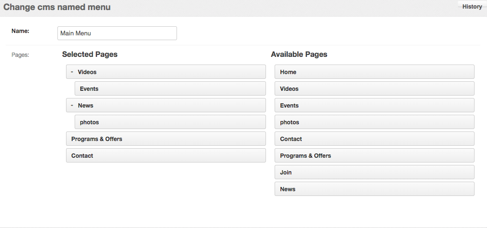

Django CMS Named Menus
=====================

An extension for Django CMS that allows you to create multiple menus like Wordpress

Installation
------------

1. Install with pip ``pip install django-cms-named-menus``

2. Add ``cms_named_menus`` to INSTALLED_APPS

Usage
-----

After installation, place the ```` template tag where you want your menu to appear.

.. code::

  

  <ul>
    
  </ul>

Next, create your menu in the admin area using the drag and drop interface.

